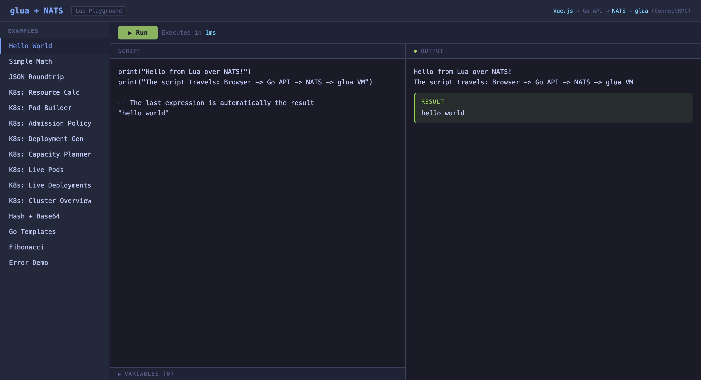
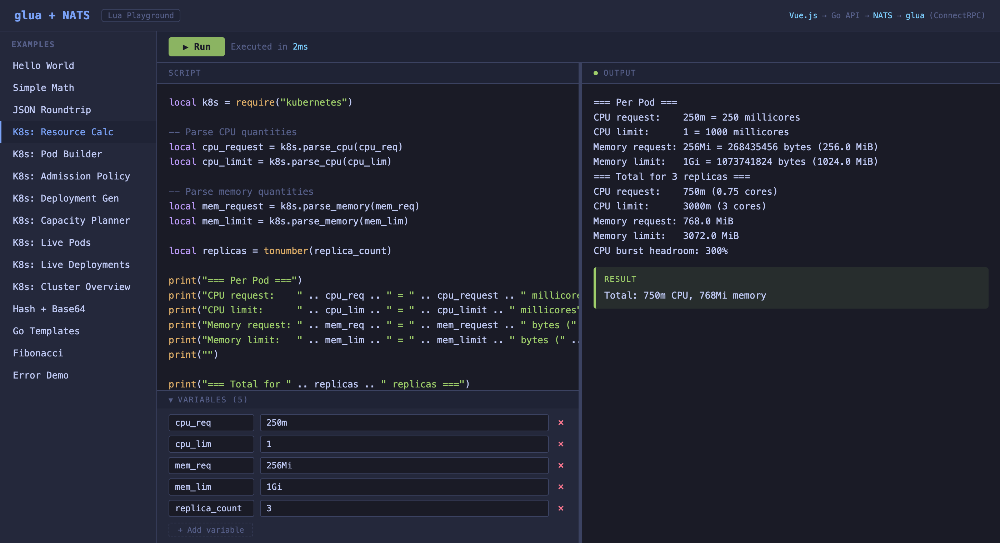
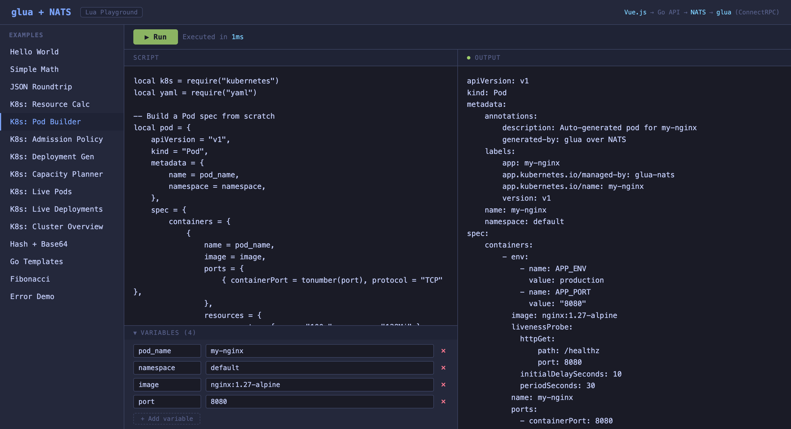
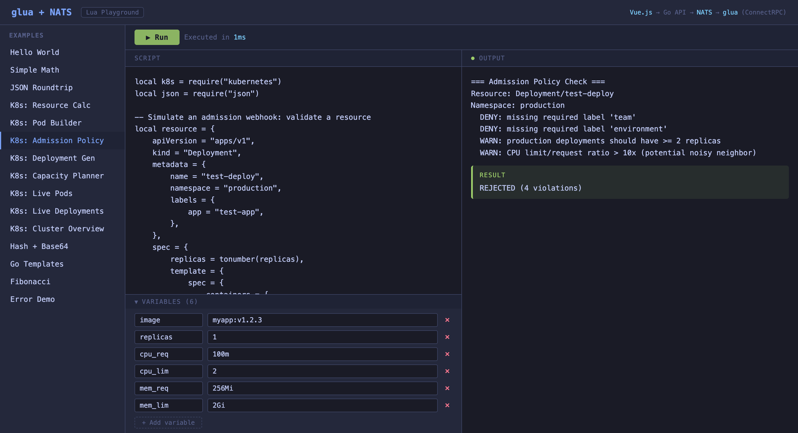
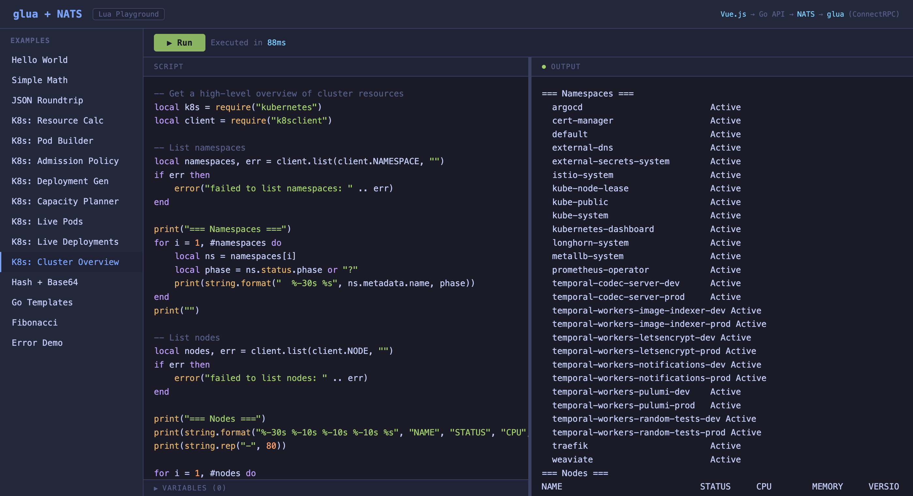
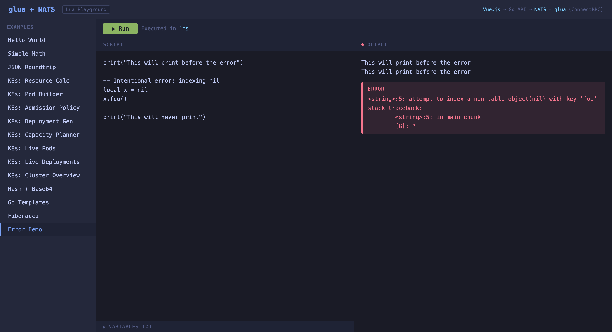

# glua + NATS: Lua Playground over NATS

A demo application that runs Lua scripts over [NATS](https://nats.io) using [ConnectRPC](https://connectrpc.com). Scripts are executed in a [glua](https://github.com/thomas-maurice/glua) VM on the server side, with RPC transport provided by [natsgrpc](https://github.com/thomas-maurice/natsgrpc).

Includes a web UI for interactive script execution, Kubernetes resource manipulation, and live cluster queries.



## Architecture

```
Browser (Vue.js)
    |
    | HTTP POST /api/execute
    v
Go Web Server (cmd/web)
    |
    | ConnectRPC over NATS
    v
NATS Server
    |
    | ConnectRPC over NATS
    v
Lua Execution Server (cmd/server)
    |
    | glua VM + modules
    v
Result (logs, return value, errors)
```

The web server acts as a bridge: it receives HTTP requests from the browser, forwards them as ConnectRPC calls over NATS to the Lua execution server, and returns the results. The Lua server is completely decoupled from HTTP — it only communicates via NATS subjects.

## Quick Start

```bash
docker compose up --build
```

Open **http://localhost:8080** in your browser.

### With Kubernetes cluster access

To enable live cluster queries (the `k8sclient` module), create a token-based kubeconfig:

```bash
# Create a service account with view permissions
kubectl apply -f - <<'EOF'
apiVersion: v1
kind: ServiceAccount
metadata:
  name: glua-nats-demo
  namespace: default
---
apiVersion: rbac.authorization.k8s.io/v1
kind: ClusterRoleBinding
metadata:
  name: glua-nats-demo-view
subjects:
- kind: ServiceAccount
  name: glua-nats-demo
  namespace: default
roleRef:
  kind: ClusterRole
  name: view
  apiGroup: rbac.authorization.k8s.io
EOF

# Generate a kubeconfig
TOKEN=$(kubectl create token glua-nats-demo -n default --duration=24h)
SERVER=$(kubectl config view --minify -o jsonpath='{.clusters[0].cluster.server}')

mkdir -p .kube
cat > .kube/config <<KUBEEOF
apiVersion: v1
kind: Config
clusters:
- cluster:
    insecure-skip-tls-verify: true
    server: ${SERVER}
  name: cluster
contexts:
- context:
    cluster: cluster
    namespace: default
    user: glua-demo
  name: default
current-context: default
users:
- name: glua-demo
  user:
    token: ${TOKEN}
KUBEEOF
```

Then `docker compose up --build`. The server will auto-detect the kubeconfig.

## Screenshots

### Kubernetes Resource Calculator
Parse CPU/memory quantities and compute totals for capacity planning.



### Kubernetes Pod Builder
Build complete Pod specs with labels, annotations, probes, and output as YAML.



### Admission Policy Simulation
Simulate a validating admission webhook — checks labels, image tags, resource limits, replica counts.



### Live Cluster Overview
Query real cluster resources — namespaces, nodes, pods, deployments.



### Error Handling
Lua errors are captured and displayed with full stack traces.



## Project Structure

```
.
├── proto/lua/v1/lua.proto          # Protobuf service definition
├── gen/lua/v1/                     # Generated Go + ConnectRPC code
├── cmd/
│   ├── server/main.go              # Lua execution server (NATS listener + glua VM)
│   ├── web/main.go                 # Web API server (HTTP + NATS client)
│   └── client/main.go              # CLI demo client
├── web/index.html                  # Vue.js 3 single-file SPA
├── docker-compose.yml              # NATS + server + web
├── Dockerfile                      # Multi-stage build
└── screenshots/                    # Auto-generated screenshots
```

## Protobuf Service

```protobuf
service LuaService {
  rpc Execute(ExecuteRequest) returns (ExecuteResponse) {}
}

message ExecuteRequest {
  string script = 1;
  map<string, string> variables = 2;
}

message ExecuteResponse {
  string result = 1;
  string error = 2;
  repeated string logs = 3;
}
```

## Available Lua Modules

| Module | Require | Description |
|--------|---------|-------------|
| json | `require("json")` | JSON parse/stringify |
| yaml | `require("yaml")` | YAML parse/stringify |
| hash | `require("hash")` | MD5, SHA1, SHA256, SHA512 |
| base64 | `require("base64")` | Base64 encode/decode |
| hex | `require("hex")` | Hex encode/decode |
| template | `require("template")` | Go template rendering |
| time | `require("time")` | Time operations |
| kubernetes | `require("kubernetes")` | K8s quantity parsing, label/annotation helpers, GVK matching |
| k8sclient | `require("k8sclient")` | Live K8s CRUD (requires cluster access) |
| spew | `require("spew")` | Deep value inspection |

### REPL-style evaluation

The last expression in a script is automatically returned as the result — no need to set a `result` variable:

```lua
local x = 10
local y = 20
x + y
-- Result: 30
```

## Key Dependencies

- [glua](https://github.com/thomas-maurice/glua) — Go-to-Lua bridge with type-safe conversion and Kubernetes modules
- [natsgrpc](https://github.com/thomas-maurice/natsgrpc) — ConnectRPC transport over NATS
- [gopher-lua](https://github.com/yuin/gopher-lua) — Pure Go Lua 5.1 VM
- [ConnectRPC](https://connectrpc.com) — Type-safe RPC framework
- [NATS](https://nats.io) — Cloud-native messaging system
- [Vue.js 3](https://vuejs.org) — Frontend framework (CDN, no build step)

## Development

Regenerate protobuf code:

```bash
buf generate
```

Build locally:

```bash
go build -o server ./cmd/server/
go build -o web ./cmd/web/
go build -o client ./cmd/client/
```

Run the CLI demo client:

```bash
docker compose up -d nats server
./client
```
