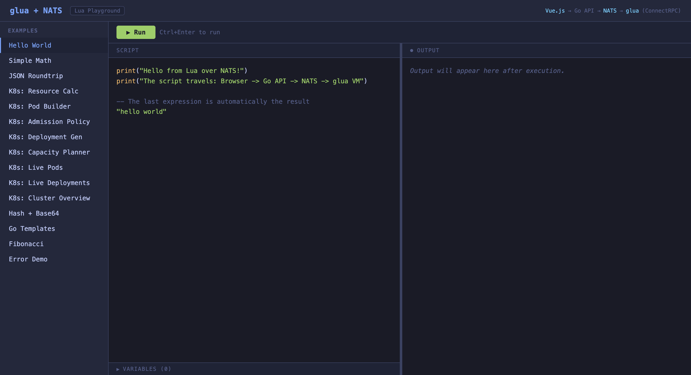
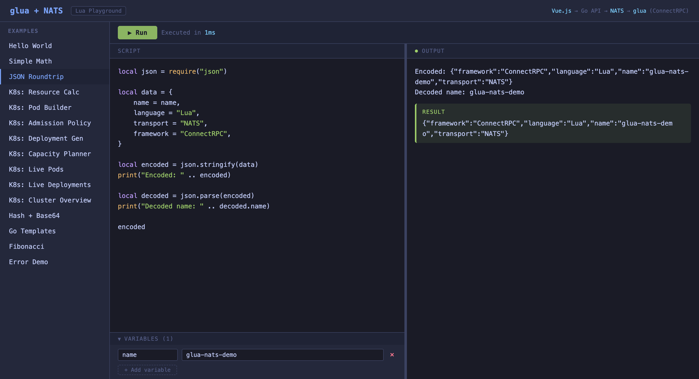
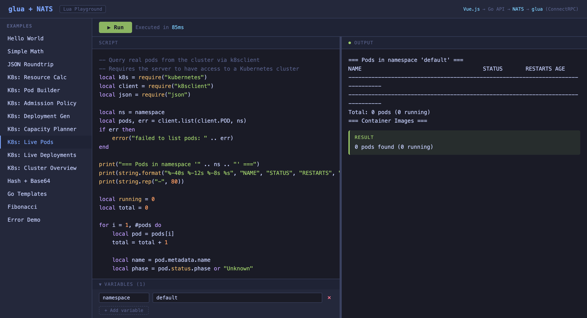
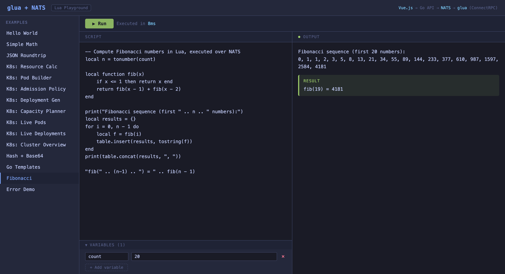

# UI Design: Single-File Vue.js Dark Theme Playground

This document describes the web UI design used in this project. It's a single HTML file with Vue.js 3 from CDN — no build step, no npm, no CSS framework. Suitable as a template for any "code playground" or "API explorer" style tool.


## Design Principles

1. **Single file** — everything in one `index.html` (HTML + CSS + JS)
2. **No build step** — Vue.js 3 loaded from CDN (`unpkg.com/vue@3/dist/vue.global.prod.js`)
3. **No CSS framework** — hand-written CSS with CSS custom properties for theming
4. **Monospace everywhere** — code editor feel using system monospace fonts
5. **Dark theme** — easy on the eyes, matches developer tooling

## Layout Structure

```
┌─────────────────────────────────────────────────────┐
│ HEADER: logo + tag + architecture breadcrumb        │
├──────────┬──────────────────────────────────────────┤
│          │ TOOLBAR: Run button + execution time      │
│          ├────────────────────┬─────────────────────┤
│ SIDEBAR  │                    │                     │
│          │   CODE EDITOR      │    OUTPUT PANEL      │
│ examples │   (textarea)       │    (logs + result)   │
│ list     │                    │                     │
│          ├────────────────────┤                     │
│          │ VARIABLES (collapsible key/value editor)  │
└──────────┴────────────────────┴─────────────────────┘
```

### Key layout decisions
- **Sidebar** is fixed-width (220px) with vertical example list
- **Editor and output** split the remaining space 50/50 with `flex: 1`
- **Variables section** sits below the editor, always visible, collapsible body
- The whole page is `height: 100vh; overflow: hidden` — no page scroll

## Color Palette

Based on [Tokyo Night](https://github.com/enkia/tokyo-night-vscode-theme) — a popular VS Code theme:

```css
:root {
  --bg:       #1a1b26;   /* main background */
  --bg2:      #24283b;   /* sidebar, headers */
  --bg3:      #1f2335;   /* toolbars, secondary bg */
  --border:   #3b4261;   /* all borders */
  --text:     #c0caf5;   /* primary text */
  --text-dim: #565f89;   /* secondary/muted text */
  --accent:   #7aa2f7;   /* links, active states */
  --green:    #9ece6a;   /* success, Run button, result blocks */
  --red:      #f7768e;   /* errors */
  --yellow:   #e0af68;   /* warnings, running state */
  --orange:   #ff9e64;   /* accent 2 */
  --cyan:     #7dcfff;   /* highlights, timing info */
}
```

## Component Details

### Header
```html
<header>
  <h1>glua + NATS</h1>
  <span class="tag">Lua Playground</span>
  <span class="spacer"></span>  <!-- flex: 1 pushes right content -->
  <span class="arch">Vue.js → Go API → NATS → glua (ConnectRPC)</span>
</header>
```
- Height: auto, fixed at top
- Border-bottom separates from content
- Architecture breadcrumb shows the tech stack with colored spans

### Sidebar
```css
.sidebar {
  width: 220px;
  background: var(--bg2);
  border-right: 1px solid var(--border);
}
```
- Each example is a clickable div with left-border highlight on hover/active
- Active state: `border-left: 2px solid var(--accent); color: var(--accent); background: var(--bg3)`
- Section header uses `text-transform: uppercase; letter-spacing: 1px; font-size: 11px`

### Code Editor
A styled `<textarea>` — no CodeMirror or Monaco needed for a demo:
```css
textarea.code {
  flex: 1;
  background: var(--bg);
  color: var(--text);
  border: none;
  padding: 16px;
  font-family: inherit;  /* monospace from body */
  font-size: 13px;
  line-height: 1.6;
  resize: none;
  outline: none;
  tab-size: 2;
}
```
- `spellcheck="false"` on the element
- Keyboard shortcut: `@keydown.ctrl.enter.prevent` and `@keydown.meta.enter.prevent` for Run

### Output Panel
Three types of output blocks:

**Log lines** — plain text, one per line:
```css
.output .log-line { color: var(--text); }
```

**Result block** — green left border with label:
```css
.output .result-block {
  background: rgba(158, 206, 106, 0.1);  /* green at 10% opacity */
  border-left: 3px solid var(--green);
  padding: 8px 12px;
  border-radius: 4px;
}
```

**Error block** — red left border:
```css
.output .error-block {
  background: rgba(247, 118, 142, 0.1);  /* red at 10% opacity */
  border-left: 3px solid var(--red);
  color: var(--red);
}
```

Both blocks use an uppercase label (RESULT / ERROR) at 11px:
```css
.output .result-label {
  font-size: 11px;
  text-transform: uppercase;
  letter-spacing: 1px;
  color: var(--green);
  margin-bottom: 4px;
}
```

### Status Indicator
A 6px dot in the output panel header:
```css
.pane-header .indicator {
  width: 6px; height: 6px;
  border-radius: 50%;
  background: var(--text-dim);  /* neutral */
}
.pane-header .indicator.ok  { background: var(--green); }
.pane-header .indicator.err { background: var(--red); }
```

### Run Button
```css
.btn-run {
  background: var(--green);
  color: var(--bg);
  font-weight: 600;
  padding: 6px 20px;
  border-radius: 4px;
}
.btn-run:disabled { opacity: 0.4; }
.btn-run.running  { background: var(--yellow); }
```

### Variables Editor
Collapsible section below the code editor:
- Header toggles `showVars` on click with arrow indicator (`▶` / `▼`)
- Each variable is a row with key input (120px), value input (flex: 1), remove button
- "Add variable" is a dashed-border button
- Inputs use `background: var(--bg); border: 1px solid var(--border)` with accent focus ring

## Vue.js Architecture

The entire app is a single `setup()` function with `ref()` state:

```javascript
const { createApp, ref } = Vue

createApp({
  setup() {
    const script = ref('')
    const variables = ref([])        // [{key: '', value: ''}]
    const output = ref(null)         // {result, error, logs, time_ms}
    const running = ref(false)
    const lastTime = ref(null)       // ms
    const activeExample = ref(0)
    const showVars = ref(false)

    function loadExample(i) { /* ... */ }

    async function execute() {
      const resp = await fetch('/api/execute', {
        method: 'POST',
        headers: { 'Content-Type': 'application/json' },
        body: JSON.stringify({ script, variables }),
      })
      output.value = await resp.json()
    }

    return { script, variables, output, running, ... }
  }
}).mount('#app')
```

### Example data structure
```javascript
const examples = [
  {
    name: 'Hello World',
    script: `print("Hello!")
"result value"`,
    variables: [],
  },
  {
    name: 'With Variables',
    script: `print("Name: " .. name)
name .. " processed"`,
    variables: [
      { key: 'name', value: 'World' },
    ],
  },
]
```

When an example is clicked, `loadExample(i)` copies the script and variables into the reactive state and resets the output.

## Font Stack

```css
body {
  font-family: 'SF Mono', 'Fira Code', 'JetBrains Mono',
               'Cascadia Code', monospace;
}
```

This uses the system monospace font on macOS (SF Mono), with fallbacks for Linux/Windows.

## Adapting for Other Projects

To reuse this UI pattern:

1. **Copy `web/index.html`** as your starting point
2. **Replace the examples array** with your own demo scripts
3. **Change the `fetch('/api/execute')`** call to your API endpoint
4. **Adjust the output rendering** — the `logs` / `result` / `error` structure works for any REPL-like tool
5. **Update the header** with your project name and architecture
6. **Modify the color variables** if you want a different theme

The only external dependency is `vue@3` from CDN (~40KB gzipped). Everything else is self-contained.

## Screenshots

| Screenshot | Description |
|---|---|
|  | Initial state with example loaded |
|  | After executing Hello World |
|  | JSON module with variables |
|  | Multiple variables, rich output |
|  | YAML output from Lua |
|  | Policy validation output |
|  | Live Kubernetes queries |
|  | Real cluster data |
|  | Error display with stack trace |
|  | Computation output |

## Taking Screenshots

Screenshots are generated automatically with Selenium:

```bash
pip3 install selenium
python3 screenshots/take_screenshots.py
```

Requires Chrome and the stack running on `localhost:8080`.
